```{r setup, include=FALSE}
options(htmltools.dir.version = FALSE)
```

# Boundary intonation

  - Intonation is meaningful to participants.
  - For example, speakers often use intonation to signal whether they intend to continue speaking, and listeners are attentive to these cues.

---
# Boundary intonation in DT

  - DT can provide a useful representation of the more **interactionally** critical intonational information.
  - Crucially differs from ToBI and other more phonologically detailed systems that are interested in the (meaningful) acoustic realization of F0.

---
# Transitional continuity (function)

Transitional continuity:
  
  - marks **the degree of continuity** which occurs at the transition point between IUs.
  - When a speaker arrives at the end of an IU, poised to continue -- or not continue -- on to the next, the intonation contour usually gives a fairly clear indication of whether the discourse business at hand will be continued, or has finished.
  - ... or is even occasioning a response.

  
---
# Transitional continuity (function)

We focus on 3 general contours:

  1. Final
  2. Continuing 
  3. Appeal

---
# Transitional continuity (form)

While the intonation contour classes in this set are defined in terms of their function, each category will be more or less consistently realized by a specific form:
  
  - a specific acoustic contour, or set of contours, where each member of the set is determined by its context.

---

# Transitional continuity (form)    

Range of phonetic realizations for a given boundary intonation class differs from one language to the next:
  
  - this is one reason for using functionally based categories.
  - this helps to ensure that similar intonational functions will be written similarly across languages, ...
  - facilitating comparison even where acoustic realizations differ.

---

background-image: url(images/IU_Continuities.png)

# Transitional continuity

---
class: inverse

# Important Note!

## Punctuation in DT **always** represents intonation classes. It is *never* used to represent grammatical information. 

---

# Final 

**Final intonation contour** = while it is being uttered, there is no indication that the speaker intends to continue speaking after the current IU.
  
  - This transitional continuity is marked by a **period (.)**
  - In English (and many other languages), final is marked by a fall to low pitch.

---

# Final

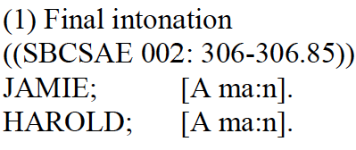

<audio controls>
<source src="audio/BoundarySample1.mp3" type="audio/mp3">
</audio>

---

# Final

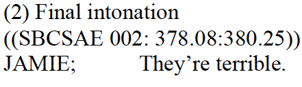

<audio controls>
<source src="audio/BoundarySample2.mp3" type="audio/mp3">
</audio>

---
# Final

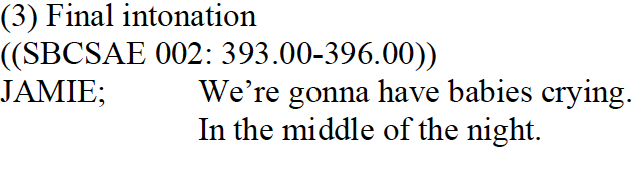

<audio controls>
<source src="audio/BoundarySample3.mp3" type="audio/mp3">
</audio>

---
# Continuing

**Continuing intonation contour** = while it is being uttered, the speaker intends to continue speaking after the current IU.

  - This transitional continuity is marked by a **comma (,)**
  - In English (and other languages), fall to mid-level pitch, ... but it may have other realizations as well, each of which presumably has slightly different pragmatic implications

    - for example, a terminal pitch that remains level, 
    - a very slight rise in pitch at the end of the IU, 
    - a pitch that falls slightly but not low enough to be considered final.

In practice the comma represents a broad cover symbol for a variety of non-final contours...

---
# Continuing boundary intonation

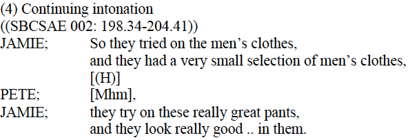

<audio controls>
<source src="audio/BoundarySample4.mp3" type="audio/mp3">
</audio>

---
### Continuing boundary intonation
.pull-left[
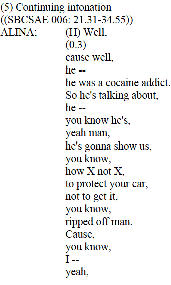
]

.pull-right[
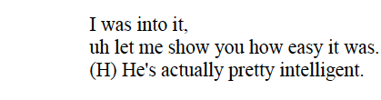
<audio controls>
<source src="audio/BoundarySample5.mp3" type="audio/mp3">
</audio>
]
---
# Appeal

**Appeal intonation contour** = when a speaker, in producing an utterance, overtly seeks a validating response from a listener.

  - This transitional continuity is marked by a **question mark (?)**
  - In English (and many other languages), appeal is realized by a marked high rise in pitch at the end of the IU.
    - most commonly a yes-no question, but not all yes-no questions are said with the appeal contour, 
    - in such cases the question should not be written with a question mark.
    
---
# Appeal (cont.)

Appeal contour may be used in contexts other than a yes-no question, 
  -  in such cases the question mark should be used.
  - (speaker nods in agreement with example below)
  
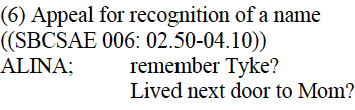

<audio controls>
<source src="audio/BoundarySample6.mp3" type="audio/mp3">
</audio>

--- 
# Appeal (cont.)

  - question mark can be followed by a period or a comma 
  - indicating whether the IU with the appeal contour is considered to be final or continuing, respectively.

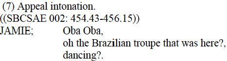

<audio controls>
<source src="audio/BoundarySample7.mp3" type="audio/mp3">
</audio>  

---
# Appeal (cont.)

  - question mark can be followed by a period or a comma 
  - indicating whether the IU with the appeal contour is considered to be final or continuing, respectively.

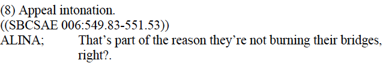

<audio controls>
<source src="audio/BoundarySample8.mp3" type="audio/mp3">
</audio>  


---
# Appeal (cont.)

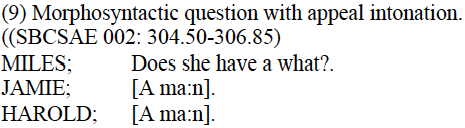

<audio controls>
<source src="audio/BoundarySample9.mp3" type="audio/mp3">
</audio>

---
# Appeal (cont.)

  - the question mark is \textit{not} used for a grammatical question uttered with intonations other than the appeal contour,
  - such as declarative contours.
  
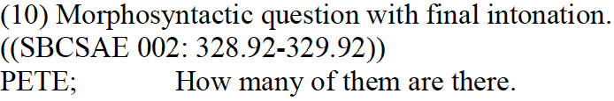

<audio controls>
<source src="audio/BoundarySample10.mp3" type="audio/mp3">
</audio>

---
# Summary

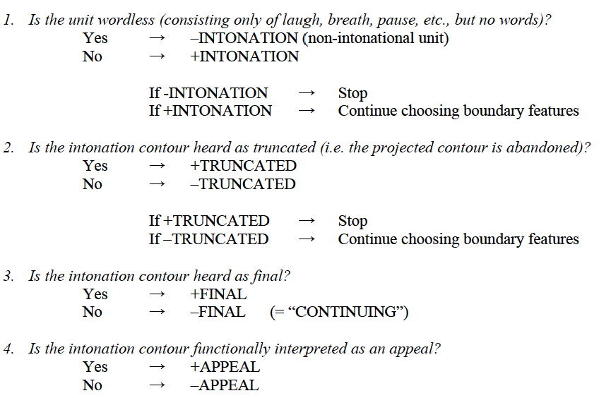

---
# Let's practice!


<audio controls>
<source src="audio/SBC005_0172-0212.mp3" type="audio/mp3">
</audio>
