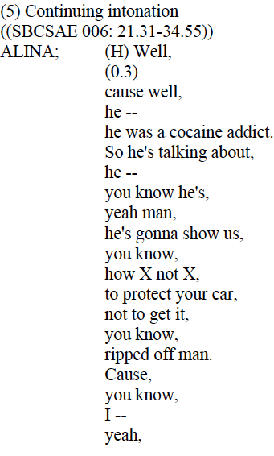
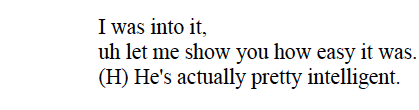
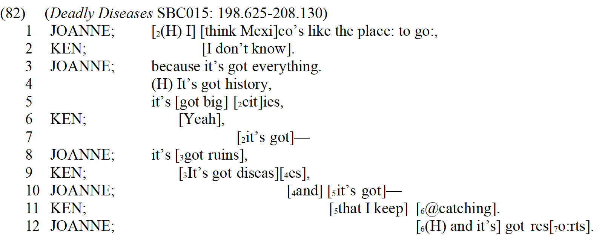
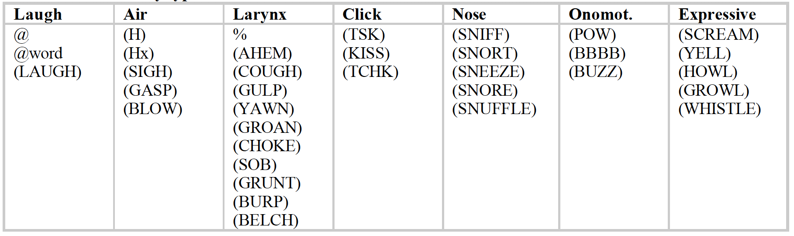

```{r setup, include=FALSE}
options(htmltools.dir.version = FALSE)
```

# Level 3

Marks some aspect of the boundary between one unit and the next

  - more specific characterization of the nature of the IU boundary, 
  - an indication of some of the most important cues which mark or correlate with IU boundaries.

There are other phenomena as well, such as overlap. Let's take a look at [an example](dubois-2010-level-3-example.pdf).

---
# Additional phenomena

1. Truncation
  - word truncation (-) (en dash)
  - IU truncation (--) (em dash)

2. Overlap

3. Pause
  - short/micropause (..) (< 180ms)
  - long (...) or (0.1)

2. breath 
  - inhalation (H)
  - exhalation (Hx)
  
4. lag or prosodic lengthening (:)
5. latching (=)

---
# Pauses

DT marks pauses in two ways: 

  1. timed pause: marks pause duration in seconds (1.2)*
  2. micropause: marks pause with .. (pauses less than 180 ms)

*In older versions of DT, long pauses were marked with ...
  
---
# Pauses

**Internal Pause.** A pause which occurs in the middle of a speaker’s intonation unit is considered an
internal (or hesitation) pause. An internal pause should be written “where it happens”, that is, as part of
the same attribution unit as the surrounding words within the same intonation unit (that is, as located in
the linear stream of words spoken by the speaker).

**Boundary Pause.** A pause which occurs between two intonation units (that is between words which can
be attributed on prosodic grounds to separate intonation units) is considered a boundary pause. Boundary pauses can be further divided into two categories, the medial pause and the transitional pause:

  1. Medial/Continuation Pause. A pause which occurs between two intonation units, both of which are
uttered by the same speaker, is considered a medial (or continuation) pause.
  1. Transitional/Turn/Change Pause. A pause which occurs between two intonation units, each of which is
spoken by a different speaker, is considered a transitional (or turn, or change) pause.


---
### Pause examples

.pull-left[

]

.pull-right[

<audio controls>
<source src="audio/BoundarySample5.mp3" type="audio/mp3">
</audio>
]

---
### Pause Types and Pause Transcription: Placement Rules

| Pause Type | Locus | Comments | Transcription |
| --- | --- | --- | --- |
| boundary pause | at the boundary between two intonation units | <small><ul><li>the most common type of pause in spontaneous speech</li> <li>serves as a cue for intonation unit boundaries</li> <li>to iconically represent the fact that the pause represents a discourse moment that is relatively for appropriation by any participant, boundary pause is written on a line by itself</li> </ul></small>| on a line by itself, between two intonation units |
| turn-boundary pause | at the boundary between two turns | <small><ul><li>basically the same as a boundary pause, but the boundary it defines is (also) between two turns (or at least between the words of the prior speaker and next speaker)</li><li>carries greater ambiguity as to whose pause it is: prior, next, or some other speaker</li></ul></small> | on a line by itself, between two turns |

---
### Pause Types and Pause Transcription: Placement Rules

| Pause Type | Locus | Comments | Transcription |
| --- | --- | --- | --- |
| medial pause | between the words of a single intonation unit | <small><ul><li>occurs in the midst of an in-progress intonation unit, often as part of a word search</li><li>the in-progress intonation unit may also represent an in-progress turn-constructional unit</li><li>assumes that the overall intonational cues suggest the absence of an intonation unit boundary, despite the pause</li></ul></small> | same line as surrounding speech, part of same intonation unit |


---
### Pause Types and Pause Transcription: Placement Rules

| Pause Type | Locus | Comments | Transcription |
| --- | --- | --- | --- |
| marginal pause | between in-breath and the body of the intonation unit | <small><ul><li>occurs following an in-breath, considered to bea strong cue for claiming the start of an intonation unit and/or the start of a turn</li><li>occurs at the left margin of the intonation unit, before the first word</li><li>positioned like a boundary pause, but not open for appropriation by other participants</li></ul></small> | same line as surrounding vocalizations (e.g. breath and speech), part of same intonation unit |

---
### Pause Types and Pause Transcription: Placement Rules

| Pause Type | Locus | Comments | Transcription |
| --- | --- | --- | --- |
| hold/micropause | between words, as very short pause or break in rhythm | <ul><li>normally considered to be a rhythmic aspect of speech involving (a) a momentary lapse or interruption of ongoing speech, or (b) a momentary delay of uptake in a new turn </li><li>typically functions as a feature, often more or less predictable, of the speech it immediately precedes</li></ul> | immediately before the following speech, as part of the same intonation unit |

---
### Pause Types and Pause Transcription: Placement Rules

| Pause Type | Locus | Comments | Transcription |
| --- | --- | --- | --- |
| breath-filled pause | when only sound is audible breath |<ul><li>would be treated as a pause except for audible in-breath</li><li> may function for participants partly like a pause, partly like a turn, turn bid, or turn start</li></ul> | typically on same line as following speech by same speaker |
| filled pause | when only sound is a hesitation word | <ul><li> hesitation words (e.g. uh, um, etc.) are often produced with stylized/chant steady pitch</li><li>controversial whether should be termed pauses</li></ul> | spelled according to conventions for marginal words |

---
# Overlap

Overlap is defined as simultaneous speech (or other vocal activity) by two or more participants in a given interaction.

**Notations**
  - (1st set) [	]	align left square brackets vertically overlap 
  - (2nd set) [<sub>2</sub>	]	left square brackets indexed with subscript

*Once there is one line where no overlap occurs, you may begin the first set without subscripts again.*

---
# Overlap (extreme example)




---
# Overlap

|     Do    |     Don’t    |
|-|-|
| Use square brackets exclusively for marking overlap. | Never use square brackets for anything   other than overlapping speech (such as comments, phonetic transcription, etc.--for each of these, an alternative notation is provided). |
|     Use a left square bracket to indicate the start   of an overlap, and a right square bracket to indicate the end.    |     Don’t leave the end of an   overlap unmarked.    |
|     For every left bracket, there should be a   corresponding right bracket for the same speaker.    |     Don’t overlook cases of unmatched or stray brackets. ||


---
### Overlap

|     Do    |     Don’t    |
|-|-|
|     Align left brackets vertically, to iconically   represent the same moment of discourse time.    |     Don’t align right brackets. Never manipulate the transcription (by   inserting spaces, etc.) to try to get the right brackets to overlap. Let the   right brackets fall where they may.    |
|     Insert enough spaces (never tabs) before the   second speaker’s left bracket to make it align vertically with the first   speaker’s left bracket.    |     Never insert extraneous spaces in the middle of   a word (e.g. in an attempt to get right brackets to align vertically). Space   has a meaning which should be respected-it marks word boundaries- ||


---
# Truncation

  1. IU truncation: at the moment of utterance, the speaker intended to bring the intonational contour to its completion but then abandons it before finishing.*
    - em dash

  2. Word truncation: A word is cut-off or abandoned 
    - en dash

***The em dash is not intended to represent the case of a unit which appears incomplete when measured against the canons of normative grammar!!**

---
# Lengthening

*Colon (:)* indicates that the preceding segment is lengthened to a degree greater than what is expected on the basis of accent, lexical stress or length, or position in IU.

*For "superlong" segments it is possible to use double or even triple colon (e.g., :: or :::).*


---
# Brief introduction to other categories

For the rest of these topics, please see the handouts and audio file examples in Laulima. Go to Resources/Handouts/dt/ to find them.

---
# Vocalism

Vocalisms can be defined as sounds which are (1) produced with the same apparatus that produces speech (i.e. the human vocal tract), but (2) which are not a part of speech per se.



---
# Manner of Speaking

If we perceive that a speaker employs some distinctive quality in their speech, we hear it as introducing an element of significance, one which is likely to prove relevant to the framing and interpretation of the utterance at hand.

  - We employ HTML-like tags with a default <VOX>  </VOX>
  - We can also use <SING> </SING>, <COWBOY> </COWBOY>, etc.

---
# Questions?
