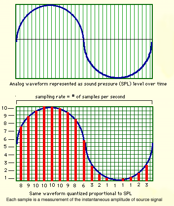

class: center, middle

---
# Preliminaries: 
1. lameta, spreadsheet, and meta-data
2. CITI and human subjects
3. Audio and video assignments
4. Any else?

---

# What is sound?

Sound is waves of pressure in the air:

[source](http://bentibbetts.net/wp/?p=8772)

---

# What is sound?

.pull-left[**Sound is like waves in the ocean:**
- High vs. low pitch = frequent vs. infrequent waves
  - Frequency of a sound wave
- Loud vs. quiet = height of the wave
  - Volume, Amplitude, or Intensity 
- Loud vs. quiet = closer or farther
]

.pull-right[

]

---

# Pop quiz

1. Rank sound wavs from lowest to highest pitch...

2. Rank sound wavs from lowest to highest amplitude...

---

# What is sound?

---

# Keys for audio recording

Frequency in Hertz (Hz) or Kilohertz (kHz)
 - 1,000 Hz = 1kHz

Intensity/amplitude/volume in decibels (dB)
  - Humans hear between 20Hz and 20,000Hz
  - Microphones should be around the same range!

---

# Hearing with our ears

<iframe width="560" height="315" src="https://www.youtube.com/embed/T8lKKlnnC6M" frameborder="0" allow="accelerometer; autoplay; encrypted-media; gyroscope; picture-in-picture" allowfullscreen></iframe>

[Description of hearing](https://youtu.be/T8lKKlnnC6M)

--

1. Air pressure vibrates eardrum 
2. Translated into electrical impulses
3. Electrical impulses sent to the brain

---

# Hearing with a microphone

<iframe width="560" height="315" src="https://www.youtube.com/embed/PE6Qn4ZiEyo" frameborder="0" allow="accelerometer; autoplay; encrypted-media; gyroscope; picture-in-picture" allowfullscreen></iframe>

[Introducing microphones video](https://youtu.be/PE6Qn4ZiEyo)

---

# Hearing with a microphone

- Dynamic and condesor
- The anatomy of microphones
  - Phantom power
  - Transducer (sound wave > electrical energy)
  - Microphone Diaphram
- Frequency response
- Polar patterns

---

# Dynamic vs. condensor microphones

.pull-left[**Dynamic**
- Rugged
- No extra power
- Not sensitive
]

.pull-right[
**Condensor**
- Delicate
- Extra power needed
  - Battery, phantom power (see below)
- Very sensitive
]

---

# Dynamic vs. condensor microphones

<iframe width="560" height="315" src="https://www.youtube.com/embed/Mxp3eCCQyas?start=79" frameborder="0" allow="accelerometer; autoplay; encrypted-media; gyroscope; picture-in-picture" allowfullscreen></iframe>

[Dynamic vs. Condensor Microphone](https://youtu.be/Mxp3eCCQyas?t=1m19s)

---

# Dynamic microphones

### Which type of microphone do documentary linguists want?

---

# Frequency response

<iframe width="560" height="315" src="https://www.youtube.com/embed/7TH82dx7Qas?rel=0&amp;showinfo=0&amp;start=14" frameborder="0" allow="autoplay; encrypted-media" allowfullscreen></iframe>

[Frequency response tutorial](https://youtu.be/7TH82dx7Qas?t=14s)

### Key concept: Flat vs. Roll off

---

# Polar patterns

<iframe width="560" height="315" src="https://www.youtube.com/embed/rYWnSuAxato?start=22" frameborder="0" allow="accelerometer; autoplay; encrypted-media; gyroscope; picture-in-picture" allowfullscreen></iframe>

[Polar pattern tutorial](https://youtu.be/rYWnSuAxato?t=22s)

See: [additional tutorial on polar pattern](https://youtu.be/0cj18EQQAm8)

---

# Polar patterns

- Omndirectional
- Unidirectional
  - Cardiod
  - Super-cardiod
- Bidirectional

**What about polar patterns in stereo microphones?**

---

# Electrical output

[Micorphone specifications](https://youtu.be/UYMaRhRt8Ts?t=10s)
- Balanced output
  - [XLR vs.  1/4"  vs. 3.5mm](https://youtu.be/ZAKhh8wpXDE?t=19s)
    - XLR pins (3, 5, 6, 7)
    - Balanced vs. unbalanced
    - TS vs. TRS

- Microphone pad
- Phantom power

---

# Hearing is NOT listening

Cocktail party effect
<iframe width="560" height="315" src="https://www.youtube.com/embed/iO3jTl0WuS4?rel=0&amp;showinfo=0&amp;start=3" frameborder="0" allow="autoplay; encrypted-media" allowfullscreen>
</iframe>

[Cocktail party effect](https://youtu.be/iO3jTl0WuS4?t=3s)

An example

<audio controls>
<source src="https://bradleymcdonnell.squarespace.com/s/mono-studentdiscussion.wav" type="audio/wav">
</audio>

---

# Hearing is NOT listening

- Ears only hear, brains listen
- Mics don't have brains

**Documentary linguists need to be the brain!**

---

# Two ears, one brain

One ear = mono

<audio controls>
<source src="https://bradleymcdonnell.squarespace.com/s/NSY-20170712-CB-Segment-Mono.wav" type="audio/wav">
</audio>

Two ears (like a mouse) = stereo

<audio controls>
<source src="https://bradleymcdonnell.squarespace.com/s/NSY-20170712-CB-Segment-Stereo.wav" type="audio/wav">
</audio>

Two ears (like a human) = binaural/ORTF
 - Organisme Francais de Radiodiffusion et de Television
 - Volume differences across two cardioid mics at 110 degrees 
 - Timing differences at 17cm apart 

---

# Two ears, one brain

Compare...

<audio controls>
<source src="https://bradleymcdonnell.squarespace.com/s/mono-studentdiscussion.wav" type="audio/wav">
</audio>
 
<audio controls>
<source src="https://bradleymcdonnell.squarespace.com/s/ortf-studentdiscussion.wav" type="audio/wav">
</audio>

 

---

# Binaural vs. stereo example

Binaural vs. stereo
<iframe width="560" height="315" src="https://www.youtube.com/embed/5KSMASKjwUI?rel=0&amp;showinfo=0&amp;start=8" frameborder="0" allow="autoplay; encrypted-media" allowfullscreen></iframe>

---

# Interem summary and advice

Recordings can be:

- Mono
- Stereo
- Binaural

Microphones have directionality:

- Omndirectional
- Unidirectional
  - Cardiod
  - Super-cardiod
- Bidirectional

---

# Advice

When in doubt choose...

1. a **stereo** microphone (cardiod) with an *audio recorder*
2. a **shotgun** microphone (super-cardiod) with a *video recorder*

---

# Reputuable brands for microphones

1. AKG
2. Audio-Technica
3. Rode
4. Sennheiser
5. Shure
6. ...

---

# Using microphones for the best quality

1. Monitor recordings
2. Maintain a good *signal to noise ratio*
3. Microphone placement
4. Minimize background noise

---

# Monitor recordings
.pull-left[

]

.pull-right[
- Monitor recordings (as much as possible)
  - But *don't* continuously adjust sound levels
  - It's okay to peak when sound is loud
]

---

# Audio issues

- Keep sound levels from -20dB to -12dB
  - see Shut Up and Shoot, p. 196-197

No clipping

<audio controls>
<source src="https://bradleymcdonnell.squarespace.com/s/unclipped-sound-problems.wav" type="audio/wav">
</audio>

Clipping 

<audio controls>
<source src="https://bradleymcdonnell.squarespace.com/s/clipped-sound-problems.wav" type="audio/wav">
</audio>

---

# Signal to noise ratio

- Background noise is inevitable, but keep it at a minimum
- 10:1 = language is ten times as loud as background noise 
- 1:1 = language is as lound as background noise

---

# Signal to noise ratio

A good signal to noise ratio can be acheived by considering...
- Microphone placement
- External noise (road noise, rain)
- Room acoustics

*Which recording has the better sound quality?*

<audio controls>
<source src="https://bradleymcdonnell.squarespace.com/s/rob-bad-sample-sound-problems.wav" type="audio/wav">
</audio>

<audio controls>
<source src="https://bradleymcdonnell.squarespace.com/s/rob-good-sample-sound-problems.wav" type="audio/wav">
</audio>

---

# Microphone placement

Maximize signal...
- Place microphone as close as possible
  - Microphone shouldn't be closer than 7-8 inches from speaker's mouth
  - Position headworn microphones to the side of the mouth
      - Read microphone instruction manual
  - In recording groups, consider the polar pattern
      - Move microphone closer to soft-spoken speakers

---

# Handling noise

**Avoid handling noise!**

<audio controls>
<source src="https://bradleymcdonnell.squarespace.com/s/microphone-touching-sound-problems-sppz.wav" type="audio/wav">
</audio>

- Use cradles and mic stands
  - Not uncommon for people to touch microphone or play with table

---

# Room acoustics

.pull-left[
<iframe width="560" height="315" src="https://www.youtube.com/embed/cp56A6TcL1E" frameborder="0" allow="accelerometer; autoplay; encrypted-media; gyroscope; picture-in-picture" allowfullscreen></iframe>

[Bad room acoustics](https://youtu.be/cp56A6TcL1E?t=1s)
]

.pull-right[
<iframe width="560" height="315" src="https://www.youtube.com/embed/cp56A6TcL1E?start=95" frameborder="0" allow="accelerometer; autoplay; encrypted-media; gyroscope; picture-in-picture" allowfullscreen></iframe>

[Better room acoustics](https://youtu.be/cp56A6TcL1E?t=1m35s)
]

--

- Sound waves bounce or rooms with lots of hard surfaces
- Dampen sound waves by using blankets, rugs, mattresses

---

# Sources of noise

- Wind
  - Use a windsheild (e.g., deadcat)
- Traffic, rivers, generators
  - Record at a different time
  - Use polar patterns to your advantange
- Poor room acoustics
  - Use rugs, mattresses, blankets to dampen sound
  

---

# Sources of noise

- Fans, electronics, refrigerators
  - Turn off, Unplug (for a bit), move (if possible)
- Noise from participants or neighbors
  - Direct people elsewhere (if possible), 
  - include them in on the recording

**It's important to work with trusted community members to help you ensure the best quality audio!**

---

# Audio problems

Can you spot the audio problems?

Turn sound low for this first example!

<audio controls>
<source src="https://bradleymcdonnell.squarespace.com/s/accumulator-fell-sound-problems.wav" type="audio/wav">
</audio>

<audio controls>
<source src="https://bradleymcdonnell.squarespace.com/s/faint-clipping-sound-problems.wav" type="audio/wav">
</audio>

<audio controls>
<source src="https://bradleymcdonnell.squarespace.com/s/faint-earring-touching-mic-sound-problems.wav" type="audio/wav">
</audio>

<audio controls>
<source src="https://bradleymcdonnell.squarespace.com/s/mosquito-killed-sound-problems.wav" type="audio/wav">
</audio>

<audio controls>
<source src="https://bradleymcdonnell.squarespace.com/s/noisy-chair-sound-problems.wav" type="audio/wav">
</audio>

<audio controls>
<source src="https://bradleymcdonnell.squarespace.com/s/thunder-sound-problems.wav" type="audio/wav">
</audio>

<audio controls>
<source src="https://bradleymcdonnell.squarespace.com/s/wind-no-deadcat-sound-problems.wav" type="audio/wav">
</audio>

---

# Recorders

Solid state recorders with XLR inputs:
 - Good place to purchase: <https://www.bhphotovideo.com>
   - [Zoom H4n $299](https://www.bhphotovideo.com/c/product/1253811-REG/zoom_h4npro_4_channel_handy_recorder.html?sts=pi)
   - [Tascam DR100MKIII $399](https://www.bhphotovideo.com/c/product/1263849-REG/tascam_dr_100mkiii_linear_pcm_recorder.html)
   - ...

---

# Sampling rate

---

# Sampling rate

- 44.1 kHz or more
- Typically stereo
  - Maybe mono
- 16 bit or more

---

# Sampling rate differences

- Sampling rate 44.1kHz 
<audio controls>
<source src="https://bradleymcdonnell.squarespace.com/s/44-1.wav" type="audio/wav">
</audio>

- Sampling rate 22.05kHz 
<audio controls>
<source src="https://bradleymcdonnell.squarespace.com/s/22-05.wav" type="audio/wav">
</audio>

- Sampling rate 11.125kHz
<audio controls>
<source src="https://bradleymcdonnell.squarespace.com/s/11-025.wav" type="audio/wav">
</audio>

- Sampling rate 5.5125kHz 
<audio controls>
<source src="https://bradleymcdonnell.squarespace.com/s/5-5125.wav" type="audio/wav">
</audio>

- Sampling rate 4kHz 
<audio controls>
<source src="https://bradleymcdonnell.squarespace.com/s/4.wav" type="audio/wav">
</audio>

---

# Basic audio setup
<!-- [Zoom H4n $299](https://www.bhphotovideo.com/c/product/1253811-REG/zoom_h4npro_4_channel_handy_recorder.html?sts=pi) -->
  
  - [Tascam DR100MKIII $399](https://www.bhphotovideo.com/c/product/1263849-REG/tascam_dr_100mkiii_linear_pcm_recorder.html)
  - [Audio-Technica Stereo Microphone $249 ](https://www.bhphotovideo.com/c/product/761016-REG/Audio_Technica_AT2022_AT2022_X_Y_Stereo_Microphone.html)
  - [Stereo XLR cable $24.95](https://www.bhphotovideo.com/c/product/994801-REG/rode_nt4_dxlr_cable_5_pin_stereo_xlr_cable.html)
  - [Panasonic eneloop pro charger & batteries $52.99](https://www.bhphotovideo.com/c/product/1258154-REG/panasonic_k_kj17khc82a_eneloop_pro_high_capacity.html)
  - [(2) SanDisk 16GB $21.94](https://www.bhphotovideo.com/c/product/1182600-REG/sandisk_sdsdxne_016g_gnci2_extreme_16gb_sdhc_u3.html)
  - [Sony closed-back headphones $79.99](https://www.bhphotovideo.com/c/product/49510-REG/Sony_MDR_7506_MDR_7506_Headphone.html?sts=pi)
   
   **Total = 827.87**
